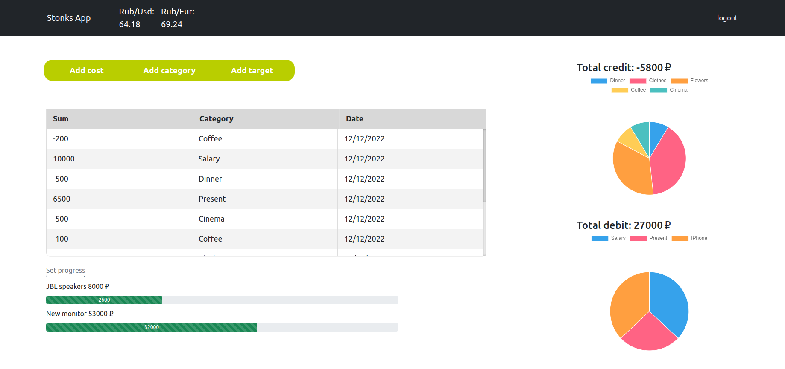

# Веб-сервис для анализа личных расходов
Приложение позволяет авторизованному пользователю вносить данные о расходах, которые отображаются 
в виде таблицы. Расходы и доходы распределяются по категориям, распределение наглядно показывается
на интерактивных диаграммах. Помимо этого, есть возможность добавлять финансовые цели, по которым
отображается шкала прогресса. В верхей части экрана размещена информация о текущем биржевом курсе
валют. 

## Бекэнд
Java 17, Spring boot, Maven, Thymeleaf; PostgreSQL

## Фронтэнд
Javascript + chart.js, html, css, bootstrap

## Особенности
<ul>
    <li>Хэширование паролей</li>
    <li>Использование паттерна DTO</li>
    <li>Взаимодействие с валютным сервисом через API</li>
</ul>
 

----------------------------------------------------------
  
# Web service for personal expenses analize
The application allows an authorized user to enter data on expenses, which are displayed in a table. Expenses and income are divided into categories, the distribution is clearly shown on interactive charts. In addition, it is possible to add financial goals for which the progress scale is displayed. The upper part of the screen contains information about the current exchange rate of currencies.

## Backend
Java 17, Spring boot, Maven, Thymeleaf; PostgreSQL

## Frontend
Vanilla JS + chart.js, html, css, bootstrap

## Features
<ul>
    <li>Password encryption</li>
    <li>DTO pattern</li>
    <li>Info from currency service by API</li>
</ul>
 

